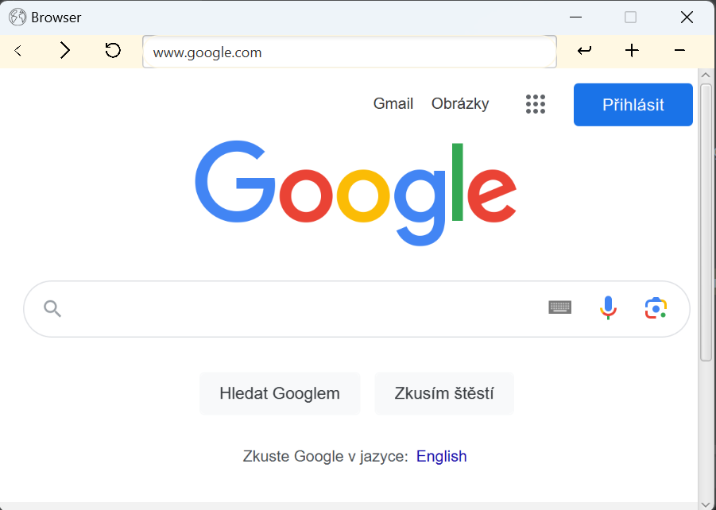

# Web in JavaFX

## Description

## Features

- **Search Functionality:** Your web application includes a search feature to efficiently find content.

- **Forward and Backward Navigation:** Users can navigate through the application with forward and backward functionalities.

- **Zoom In and Out:** The ability to zoom in and out enhances the user experience by adjusting the display.

## Getting Started

### Prerequisites

- Java Development Kit (JDK) installed
- IDE

### Installation

1. Clone the repository: git clone https://github.com/adamhitzger/JavaFX-Web.git

